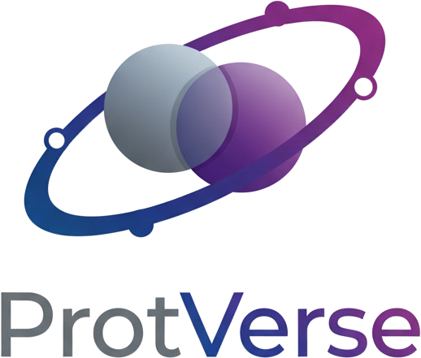

<p align="center">
  
  <br>
  <br>
  A biologically meaningful feature space of human protein pairwise functional similarity  
</p>

## Build the container images

Requires [Docker](https://www.docker.com) and [Apptainer](https://apptainer.org).

```bash
docker build -t protverse - < env/protverse.dockerfile
docker save -o env/protverse.tar.gz protverse
apptainer build env/protverse.sif docker-archive://env/protverse.tar.gz
```

```bash
docker build -t cl1 - < envs/cl1.dockerfile
docker save -o envs/cl1.tar.gz cl1
apptainer build envs/cl1.sif docker-archive://envs/cl1.tar.gz
```

## Customise `*.config`

Modify `process.executor`, `process.queue`, `workDir`, and `env.out_dir` according to the infrastructure where the workflow will be executed. Find the Nextflow [configuration file](https://www.nextflow.io/docs/latest/config.html) documentation.


## Run the workflow

To build ProtVerse, run the following to gather all the data sources, build the classifiers of signalling, metabolic, and physical interaction, and assemble the proteome-wide interaction graph.

```bash
nextflow run build_protverse.nf -c build_protverse.config -resume
```

Perform community detection on the output graph to extract functionally coherent protein modules:

```bash
nextflow run extract_modules.nf -c extract_modules.config -resume
```

The main output files and figures are saved in `${env.out_dir}`, which can be set by editing `*.config`.


## Downstream analysis

To assess the biological relevance of ProtVerse protein modules, they have been compared with canonical, manually-curated pathways in their ability to fit cellular responses to perturbations as measured in independent phosphoproteomics data. This evaluation can be accessed at [https://github.com/alussana/ProtVerse-modules-validation](https://github.com/alussana/ProtVerse-modules-validation).